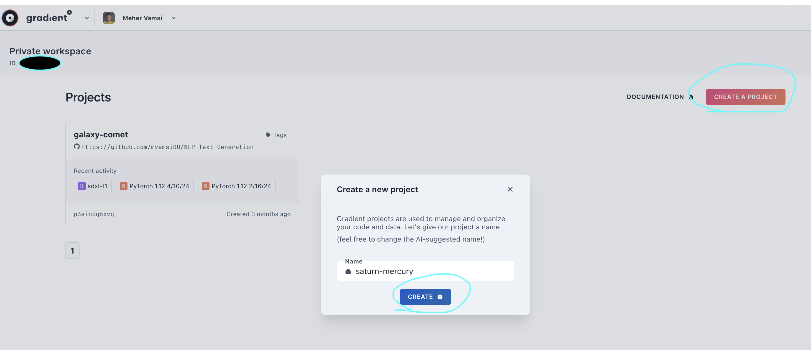
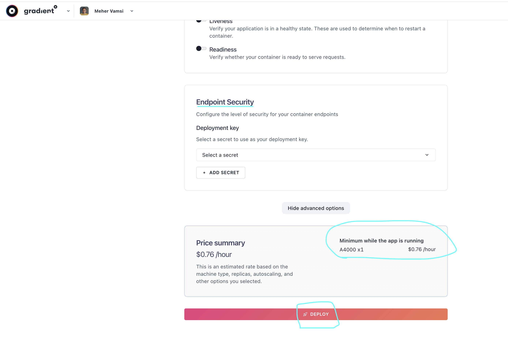

# Stable Diffusion - API - Gradient - Deployment
Gradient Deployment spec for running Stable Diffusion API.

This repo will help you spin up a REST API Stable Diffusion Endpoint on [Gradient Deployment](https://www.paperspace.com/deployments).  

The actual [Docker image](https://hub.docker.com/r/gadicc/diffusers-api) being used is created by [Kiri-art-github](https://github.com/kiri-art/docker-diffusers-ap), [kiri.art](https://kiri.art/)

> Diffusers / Stable Diffusion in docker with a REST API, supporting various models, pipelines & schedulers. Used by kiri.art, perfect for local, server & serverless.


## Setup and Test on Paperspace 
- This document will help you create the endpoint, and show how to use it via Postman Client to generate images from text. 

### Assumptions for this demo:
- `Model` being used is: `stabilityai/stable-diffusion-xl-base-1.0` 
- `GPU` being used is: `A4000` (why? the model size in GPU is about 15GB, so any GPU with 16GB RAM can be used, cheapest GPU with this config is `A4000` )
- No auto scaling (Gradient Deployments allow you to auto scale up using CPU, RAM and AVG Response time thresholds, for this we just leave it to 1 replica)


There are mainly 2 ways to you can spin up a Deployment:
1. From GUI
2. From CLI

### GUI Steps 
1. Ensure you sign up and login to [paperspace console](https://console.paperspace.com/) and create a project under [Gradient platform](https://www.paperspace.com/deployments)  


2. Create a New Deployment under `Deployments` tab


3. Select the `GPU` type (in this case `A4000`), give the deployment any name


4. Since the [docker image](https://hub.docker.com/r/gadicc/diffusers-api) is public, you can select pull from `Public Container Registry` , and provide the `image:tag` name: `gadicc/diffusers-api`


5. The original docker is configured to run on Port `8000`, also we are keeping the `Autoscale off` so only `1 instance` to spin up. Click on `Advanced Options` to provide Hugging Face token


6. Provide the Hugging Face Read access token as an environment variable


7. Review the Deployment details like, port, env variables, and pricing and hit `deploy`


8. Deployment takes a few minutes to come up, you will be able to see the status under `history` tab. On deployment completion the status will change to `success`. 
Go to `overview` tab to see the details of the endpoint. 


9. In the `overiew` tab, you can see the `endpoint url` which is base url for the application. This image has a route `/docs` that take us to the OpenAPI docs. 
We can use this to verify if the deployment was successfull.


10. Using [Postman](https://www.postman.com/downloads/) as a REST client, lets generate some images. 
- Here is the POST request JSON body needed. You can read [more about this here](https://github.com/kiri-art/docker-diffusers-api?tab=readme-ov-file#usage)
```
<!-- Request  -->
{
  "modelInputs": {
    "prompt": "Soft pink roses, white Chinese peony, tiny apple blossom flowers, eucalyptus leaves, twigs of cranberries, twigs of copper pepper berries all arrangement into a cute beautiful flowers arrangement on a pink nickel mug. The mug is sitting on a thick white book with golden cover image design. Sunny, bright image. Ad copy, huge copy space on top of the image, negative space, hd, 8k, blurry dreamy background, beautiful pictures. Product",
    "num_inference_steps": 50,
    "guidance_scale": 7.5,
    "width": 512,
    "height": 512,
    "seed": 3239022079
  },
  "callInputs": {
    // You can leave these out to use the default
    "MODEL_ID": "stabilityai/stable-diffusion-xl-base-1.0",
    // "PIPELINE": "StableDiffusionXLPipeline",
    "SCHEDULER": "EulerAncestralDiscreteScheduler",
    "safety_checker": true
  }
}

<!-- Response -->
{
  "$meta": {
    "PIPELINE": "AutoPipelineForText2Image"
  },
  "image_base64": "...",
  "$timings": {
    "loadModel": 10076,
    "inference": 18641
  },
  "$mem_usage": 0.9334381509451876
}
```


11. Another example prompt, Here is a [free online tool](https://codebeautify.org/base64-to-image-converter) to generate images from base64 strings


12. Gradient Deployment has a ton of features to help you. 
- You can monitor traffic, CPU and Memory utilisation. (GPU util is not provided, something we are looking into for future). 
- You can check the `logs` of the application
- And when you check settings, you can see option to `Disable Endpoint` and `Delete Endpoint`. Both will stop the billing, 
- `Disable` will allow you to spin the deployment back ON without changing the `URL`. 


### CLI Steps 
- Ref1: https://docs.digitalocean.com/products/paperspace/deployments/how-to/create-deployments/
- Ref2: https://docs.digitalocean.com/reference/paperspace/pspace/api-reference/#tag/Deployments

